[<<<<](../linear_algebra_notes.md)

***

## 第一课 线性代数课程简介

在线性代数这门课里面，我们将首先讨论什么是线性代数，我们可以学习到什么样的知识，可以解决什么问题。

### 1.1 引言

在开始之前，我们先提一个概念—— **系统（system）** 。系统就是一个可以利用 **输入（input）** 得到 **输出（output）** 的东西，也可以叫做函数（function）、转换（transformation），操作（operator）。

比如：

语音识别系统

对话系统

通信系统

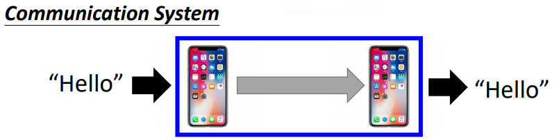

我们在线性代数这门课中，要研究的就是线性的系统。

### 1.2 线性系统

线性系统是指具备以下两个性质的系统：

1. 保留乘法特性（Persevering Multiplication），即系统的输入增加 *k* 倍，其输出也将增加*k*倍

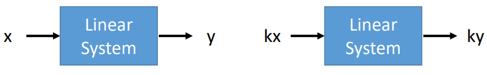

2. 保留加法特性（Persevering addition），即系统的输入增加$x_{2}$,其输出会对应输出$y_{2}$

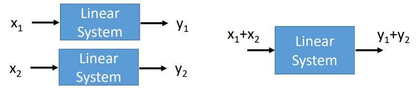

例子：判断以下系统是否为现象系统

1. 二次函数系统

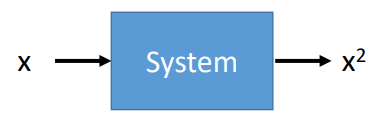

答：当输入增加为 $kx$ 时，输出为 $k^{2}x^{2}$，不满足性质1；当输入为$x_{1}+x_{2}$，输出为$(x_{1}+x_{2})^{2}$，不满足性质2。故为非线性系统。

2. 微分系统

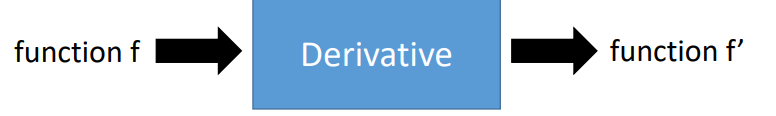

答：微分是线性系统

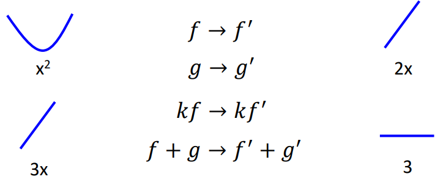

3. 定积分系统

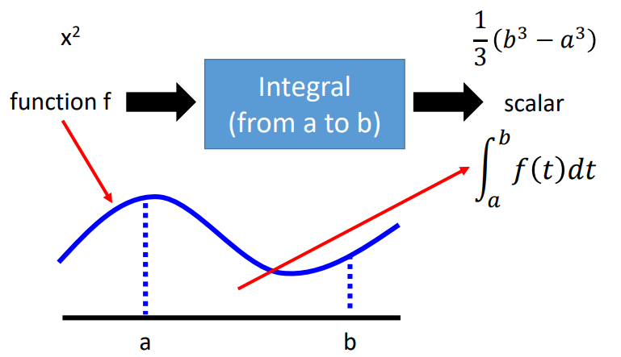

答：定积分系统是线性的，详见定积分的线性性质：https://blog.csdn.net/phoenix198425/article/details/78757050

4. 多输入输出系统

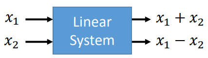

答：易证，线性系统。

### 1.3 课程内容安排

1-3 章将针对以下线性系统，完成下列问题：

1. 指定该线性系统的输出，问能否找到对应的输入，即该系统（线性方程组）是否有解？
2. 若有解，问是否是唯一解？
3. 如何找到该系统的解？
4. 还将讲到一个重要的性质——行列式。

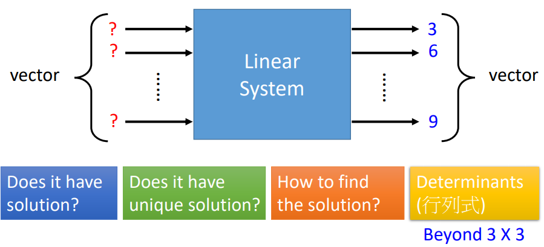

4 章关于如何将一个复杂的线性系统描述成一个简单的线性系统及相关知识。

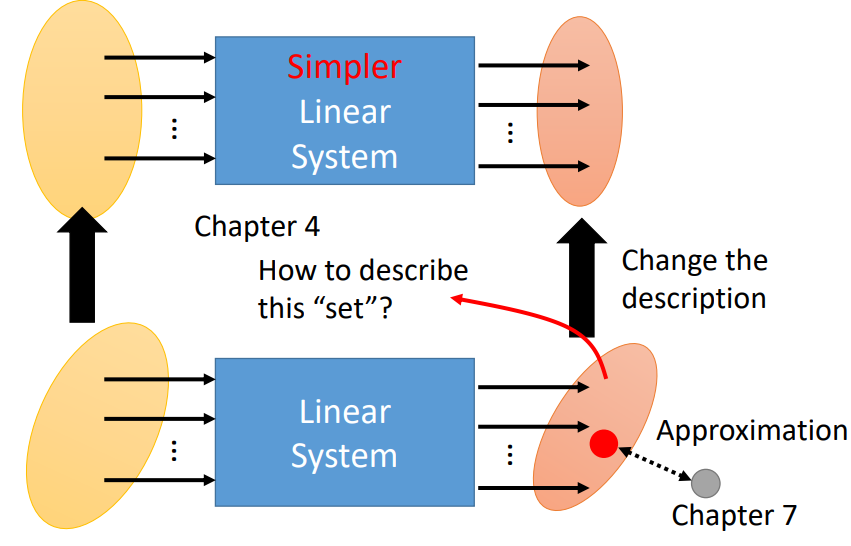

5 章关于特征值、特征向量等，我们有的线性系统可以放大某些输入而缩小另一些输入，这些都与特征值、特征向量有关，掌握这些知识，我们就可以设计一些滤波器。

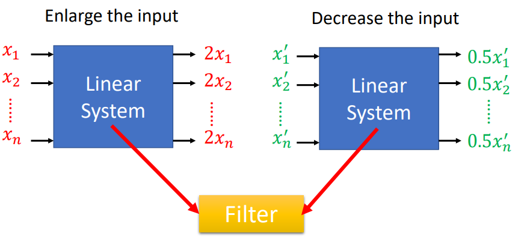

6 章关于向量。

7 章关于当线性系统无解时，如何求得近似解。

### 1.4 线性系统的应用

在我们的生活中，其实有很多系统都是（或者可以认为是）线性系统，比如

* 电路系统

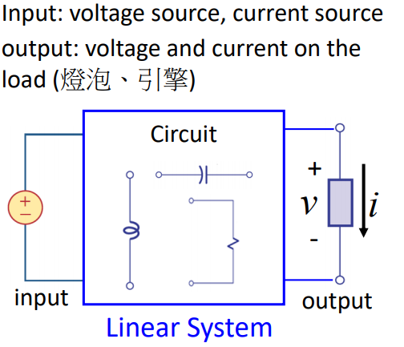

 

* 通信系统

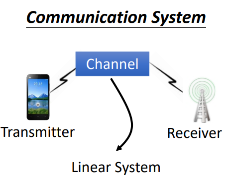

 

* 信号处理（傅里叶变换）

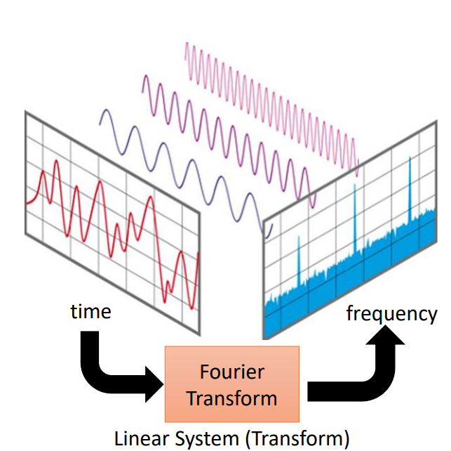

 

* 气象预测

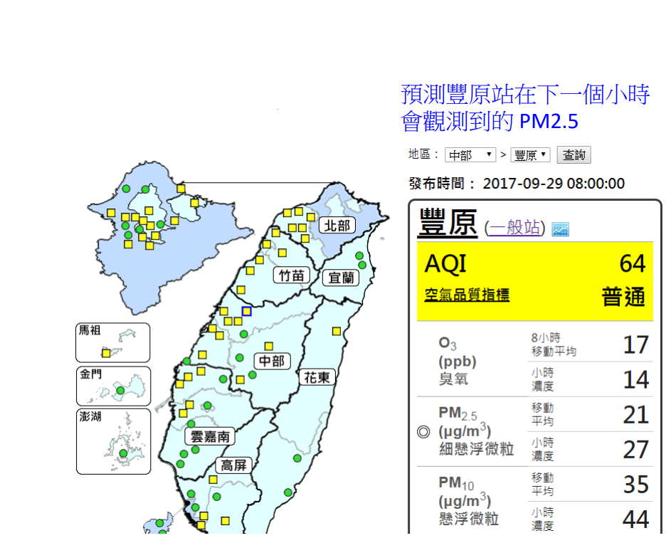

 

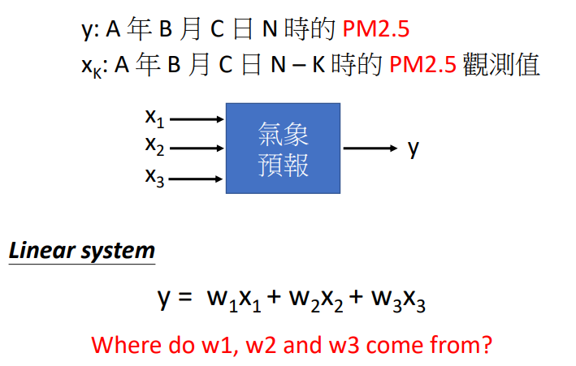

 

* 计算机图形学

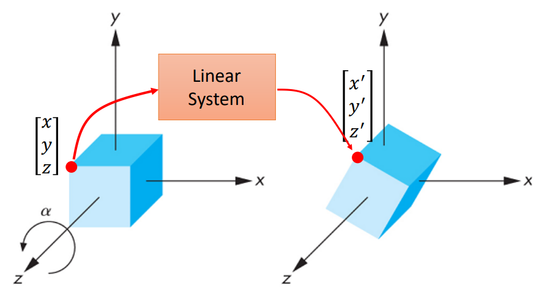

* 搜索引擎

* ……