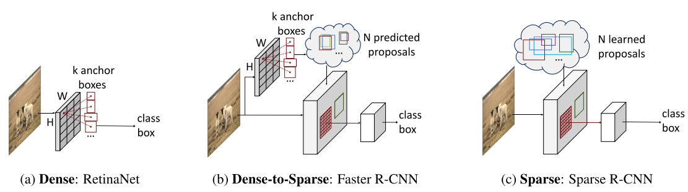

***
# 2020年目标检测新范式

以往，目标检测模型可以总结为one-stage和two-stage两种范式，但是这两种范式都是基于anchor机制的，anchor为目标检测提供了重要的先验知识，可以视为现代目标检测器的基石。2019年，anchor-free的目标检测工作被提出来，成功革掉了anchor的命，目标检测不再需要繁杂的anchor设计，极大地简化了目标检测流程。进入2020年，目标检测又进一步发展，出现了一批新的检测范式，下面进行简单总结：

## 1、Sparse R-CNN: End-to-End Object Detection with Learnable Proposals

Paper: [https://arxiv.org/abs/2011.12450](https://arxiv.org/abs/2011.12450)

Code: [https://github.com/PeizeSun/SparseR-CNN](https://github.com/PeizeSun/SparseR-CNN)

 图 1. 不同目标检测范式的比较 

### （1）Motivation

作者将现在主流的目标检测算法大概分类两大类：

* 其一是Dense Detector，诸如YOLO、RetinaNet、FCOS等。这些Dense Detector需要在图像或特征图的每个网格上分配的$k$个anchor boxes或者reference points，也就是提前预设好很多（dense）的candidates，然后直接预测目标相对这些candidates的相对位置和相对大小，如上图1-（a）所示。

* 其二是Dense-to-sparse的Detector，输入R-CNN系列。这些方法会首先利用一些方法如selective search、RNP等，从dense candidates选出一个sparse set，然后对这个sparse set进行进一步的精确预测回归和分类，如上图1-（b）所示。

这两类方法都是从dense candidates出发，其实这是非常直觉和合理的，为了提高模型的召回率和准确率，在图像上布满密密麻麻的candidates很有必要。dense candidates基本上奠定了现代目标检测的基础，推动了整个领域学术研究和工业应用。

但是作者认为，从dense candidates出发做目标检测必然会导致以下问题：

（1）产生很多冗余的检测结果，因此必须使用非极大值抑制作为后处理；

（2）many-to-one 正负样本分配问题。candidates与ground truth不可能一一对应，因此需要处理一个分配正负样本的问题，还需要处理正负样本不均衡的问题。如YOLO v3的训练过程中将与anchor的iou最大的预测框作为正样本，剩下的预测框除去iou超过一定的阈值的其余都作为负样本。

（3）检测器的最终性能严重依赖anchors的设计，包括大小、长宽比、数量等因素，依赖preference points的密度以及RPN等proposal生成方法。

因此，作者希望提出一个sparse detector，从而避免上述问题。

### （2） Sparse R-CNN

